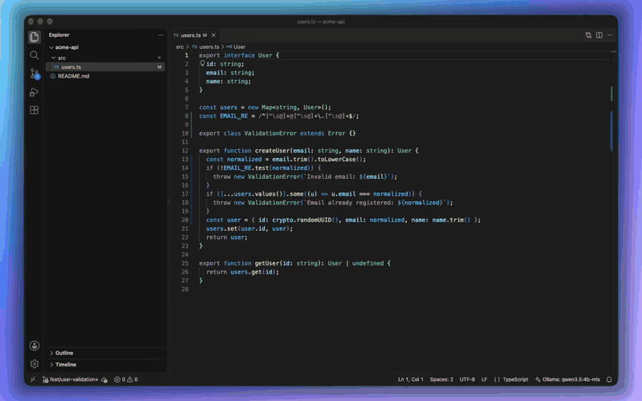

# Nuvo Commit

> Write commits, not novels. Local-first AI commit message generator.

[](https://marketplace.visualstudio.com/items?itemName=nuvocode.nuvo-commit)
[](https://marketplace.visualstudio.com/items?itemName=nuvocode.nuvo-commit)
[](LICENSE)



[Watch in full quality](docs/introduction.mp4)

## Features

- 🤖 **Multi-Provider Support**: Choose from Ollama (local), OpenAI, Anthropic, or
  the models already in VS Code (e.g. GitHub Copilot)
- 🆓 **No Key Needed with Copilot**: The VS Code provider reuses your Copilot models —
  no API key, no local server
- 🔒 **Local-First**: Run entirely on your machine via Ollama — no cloud APIs required
- ☁️ **Cloud Options**: Use OpenAI or Anthropic Claude for higher-quality results
- 🔑 **Secure Keys**: Cloud API keys are stored in VS Code's encrypted secret storage
- 🌍 **Any Language**: Write commit messages and PR content in your team's language
- 🎯 **Matches Your Repo**: Learns the style of your recent commits and follows
  the allowed types and scopes in your commitlint config
- 🚀 **Fast**: Quick commit message generation without leaving VS Code
- ⚙️ **Customizable**: Configure models, endpoints, timeouts, and behavior
- 📋 **Auto Model Detection**: Automatically list available models from your provider

## Requirements

- VS Code 1.90.0 or higher
- For **Ollama** (local): [Ollama](https://ollama.ai) installed and running, with a
  model pulled (`ollama pull qwen3:4b`)
- For **OpenAI** (cloud): an API key from <https://platform.openai.com/api-keys>
- For **Anthropic** (cloud): an API key from <https://console.anthropic.com/>
- For **VS Code** (Copilot): GitHub Copilot (or another extension that provides
  language models) installed and signed in. VS Code asks for permission the first
  time Nuvo Commit uses a model.

## Installation

1. Install the extension from the
   [VS Code Marketplace](https://marketplace.visualstudio.com/items?itemName=nuvocode.nuvo-commit).
2. Choose your provider:
   - **Local (recommended)**: install Ollama (`brew install ollama` on macOS, or see
     [ollama.ai](https://ollama.ai)).
   - **Cloud**: get an API key from OpenAI or Anthropic.
3. Follow the **Get Started with Nuvo Commit** walkthrough that opens after
   install (or configure manually, see [Configuration](#configuration)).
4. Run **Nuvo Commit: Check Setup** to confirm the provider and model work. If
   something is wrong, the error offers the fix.
5. Start generating commit messages!

## Usage

1. Stage your changes (`git add .`). If nothing is staged, Nuvo Commit falls back
   to your working-directory changes.
2. Open the Command Palette (`Cmd+Shift+P` / `Ctrl+Shift+P`).
3. Run **Nuvo Commit: Generate Commit Message**.
4. Review and accept the suggested message.

You can also click the ✨ button in the Source Control title bar.

### Generating pull request content

1. Click the pull request button in the Source Control title bar, or run
   **Nuvo Commit: Generate Pull Request Content**.
2. Pick the target branch (the default is listed first).
3. Accept to copy the title and body, copy them separately, or open GitHub's
   "create pull request" page.

### Selecting a model

1. Run **Nuvo Commit: Select Model**.
2. Pick from the discovered models, or choose "Enter manually…".
3. The selection is saved to your settings.

> **Tip:** For Ollama, the model list is fetched automatically from your local instance.

### Setting an API key (cloud providers)

API keys are stored securely per cloud provider — **not** in `settings.json`.

1. Run **Nuvo Commit: Set API Key**.
2. If Ollama is active, choose OpenAI or Anthropic.
3. Paste your key into the masked input (leave it empty to clear that provider's key).

If you previously set `nuvoCommit.apiKey` in settings, it is migrated into secure
storage automatically and removed from `settings.json` on first activation.

## Configuration

Run **Nuvo Commit: Settings** to configure only the selected provider's model,
endpoint, and API key. Provider-specific settings are also available in VS Code
Settings (`Cmd+,`) under **Nuvo Commit**:

| Setting                         | Default              | Description                                                                      |
| ------------------------------- | -------------------- | -------------------------------------------------------------------------------- |
| `nuvoCommit.autoAccept`         | `true`               | Skip the approval dialog and fill the commit message directly.                   |
| `nuvoCommit.autoCommit`         | `false`              | Run `git commit` automatically after accepting.                                  |
| `nuvoCommit.maxDiffChars`       | `12000`              | Maximum diff characters sent to the model; larger diffs are truncated.           |
| `nuvoCommit.suggestions`        | `1`                  | Number of messages to generate (1–5). More than one shows a list.                |
| `nuvoCommit.style`              | `conventional`       | Header format: `conventional`, `gitmoji` or `plain`.                             |
| `nuvoCommit.gitmoji`            | `{}`                 | Emoji per type for `gitmoji`, e.g. `{"feat": "🚀"}`.                             |
| `nuvoCommit.language`           | `English`            | Language of generated messages (e.g. `Turkish`). Types like `feat` stay English. |
| `nuvoCommit.ticketId`           | `off`                | Add the branch's ticket ID: `off`, `footer` or `prefix`.                         |
| `nuvoCommit.ticketPattern`      | `[A-Z][A-Z0-9]+-\d+` | Regular expression that finds the ticket ID in the branch name.                  |
| `nuvoCommit.provider`           | `ollama`             | AI provider: `ollama`, `openai`, `anthropic`, or `vscode`.                       |
| `nuvoCommit.ollama.endpoint`    | Ollama URL           | Ollama API endpoint.                                                             |
| `nuvoCommit.ollama.model`       | `qwen3:4b`           | Ollama model identifier.                                                         |
| `nuvoCommit.openai.endpoint`    | `""`                 | OpenAI endpoint. Leave empty to use the default OpenAI endpoint.                 |
| `nuvoCommit.openai.model`       | `gpt-4o-mini`        | OpenAI model identifier.                                                         |
| `nuvoCommit.anthropic.endpoint` | `""`                 | Anthropic endpoint. Leave empty to use the default Anthropic endpoint.           |
| `nuvoCommit.anthropic.model`    | `claude-haiku-4-5`   | Anthropic model identifier.                                                      |
| `nuvoCommit.vscode.model`       | `""`                 | VS Code language model id. Empty uses the first available model.                 |
| `nuvoCommit.requestTimeoutMs`   | `30000`              | Milliseconds to wait for a provider response before aborting.                    |

> Deprecated fallback settings `nuvoCommit.apiKey`, `nuvoCommit.endpoint`, and
> `nuvoCommit.model` are kept for upgrades. New configurations should use the
> provider-specific settings above.

### Example configurations

**Ollama (local):**

```json
{
  "nuvoCommit.provider": "ollama",
  "nuvoCommit.ollama.endpoint": "http://localhost:11434/api/generate",
  "nuvoCommit.ollama.model": "qwen3:4b"
}
```

**OpenAI (cloud):** set the key via **Nuvo Commit: Set API Key**, then:

```json
{
  "nuvoCommit.provider": "openai",
  "nuvoCommit.openai.endpoint": "",
  "nuvoCommit.openai.model": "gpt-4o-mini"
}
```

**Anthropic (cloud):** set the key via **Nuvo Commit: Set API Key**, then:

```json
{
  "nuvoCommit.provider": "anthropic",
  "nuvoCommit.anthropic.endpoint": "",
  "nuvoCommit.anthropic.model": "claude-haiku-4-5"
}
```

**VS Code / GitHub Copilot (no API key):**

```json
{
  "nuvoCommit.provider": "vscode",
  "nuvoCommit.vscode.model": ""
}
```

### OpenAI-compatible providers

The `openai` provider works with any service that speaks the OpenAI Chat
Completions API. Set `nuvoCommit.provider` to `openai`, point
`nuvoCommit.openai.endpoint` at the service's `/chat/completions` URL, and save
the service's key with **Nuvo Commit: Set API Key** (choose OpenAI). A key is
always required; for local servers that don't check it, enter any value.
**Nuvo Commit: Select Model** lists the models the service offers.

**Google Gemini** ([API key](https://aistudio.google.com/apikey)):

```json
{
  "nuvoCommit.provider": "openai",
  "nuvoCommit.openai.endpoint": "https://generativelanguage.googleapis.com/v1beta/openai/chat/completions",
  "nuvoCommit.openai.model": "gemini-3.5-flash-lite"
}
```

**OpenRouter** ([API key](https://openrouter.ai/keys)):

```json
{
  "nuvoCommit.provider": "openai",
  "nuvoCommit.openai.endpoint": "https://openrouter.ai/api/v1/chat/completions",
  "nuvoCommit.openai.model": "openai/gpt-4o-mini"
}
```

**Groq** ([API key](https://console.groq.com/keys)):

```json
{
  "nuvoCommit.provider": "openai",
  "nuvoCommit.openai.endpoint": "https://api.groq.com/openai/v1/chat/completions",
  "nuvoCommit.openai.model": "llama-3.3-70b-versatile"
}
```

**LM Studio** (local; start the server in LM Studio's Developer tab):

```json
{
  "nuvoCommit.provider": "openai",
  "nuvoCommit.openai.endpoint": "http://localhost:1234/v1/chat/completions",
  "nuvoCommit.openai.model": "<model id shown in LM Studio>"
}
```

> **Tip:** Prefer non-reasoning models. Reasoning models (e.g. `gpt-oss`,
> `qwen3`) can spend the whole response budget on hidden reasoning and return
> nothing, in which case you get the generic `chore: update staged changes`
> message.

## Development

```bash
npm install      # Install dependencies
npm run compile  # Compile TypeScript
npm run watch    # Compile in watch mode
npm run lint     # Lint sources
npm run format   # Format with Prettier
npm run test:unit       # Run Jest unit tests
npm run test:coverage   # Run unit tests with coverage
```

### Debugging

1. Open the project in VS Code.
2. Press **F5** to launch the extension in a new Extension Development Host window.

## Testing

See [TESTING.md](./TESTING.md) for detailed testing instructions.

## Publishing

See [PUBLISHING.md](./PUBLISHING.md) for the release and publishing guide.

## Changelog

See [CHANGELOG.md](./CHANGELOG.md).

## License

MIT
